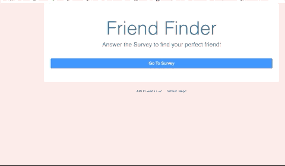
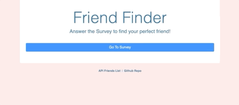
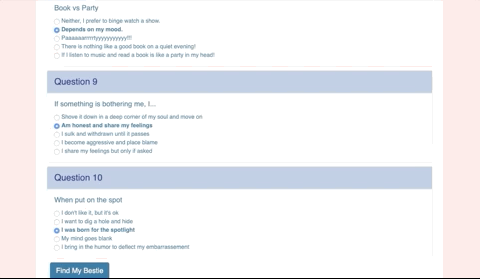

# FriendFinder

In this app, there is a basic intereaction between front-end and back-end. The user starts by filling out a survey of 10 questions. Once the user hits the submit button, their answer are sent to our server who calculates the total difference between the answer of the user and the friends already existing in the app. Once the calculation is done, the app will pop-up the best match for the user. 

# Sample Images

When the user first enters the app, they will the homepage. At this point the user can choose to 
click on the API Friends List, which will take him to the list of friends that is showcased as a JSON object. We did not use a database on this exercise, therefore this list lives in a .js file in my machine/Github Repo:



The user can also choose to click on "Go to Survey" like so:



Once in the survey, the user can choose to answer all the questions, including name and photo. Once all the questions have been answered, the user can click on the submit button below and find a match:




# Getting Started

To create this app there were a few steps and instalations that had to occur in order to be sucessful. 

## Installing

Using the packages available in the [NPM library](https://www.npmjs.com/) and node as a CLI I was able to create the back-end of this app. So the first step, after cloning my repo into my local machine, was to create a package.json that would store all my dependencies. The command below allows for that:

```
npm init -y
```

Next step was to install all the required dependencies. In this case, we were only working with Express so that was the only npm instalation required. 

```
npm install express
```

Once these two steps were done, the app could be properly developed. 

# Built With

* HTML5
* CSS
* Javascript
* Express
* Node
* Jquery

# Deployed Link

This app was deployed on Heroku.

* [See Live Site](https://gentle-spire-07039.herokuapp.com/)

# Authors

* Sara Neves Pereira

- [Github](https://github.com/SaraNP-33/)

## License

This project is licensed under the UofA Coding Certificate Bootcamp. 


